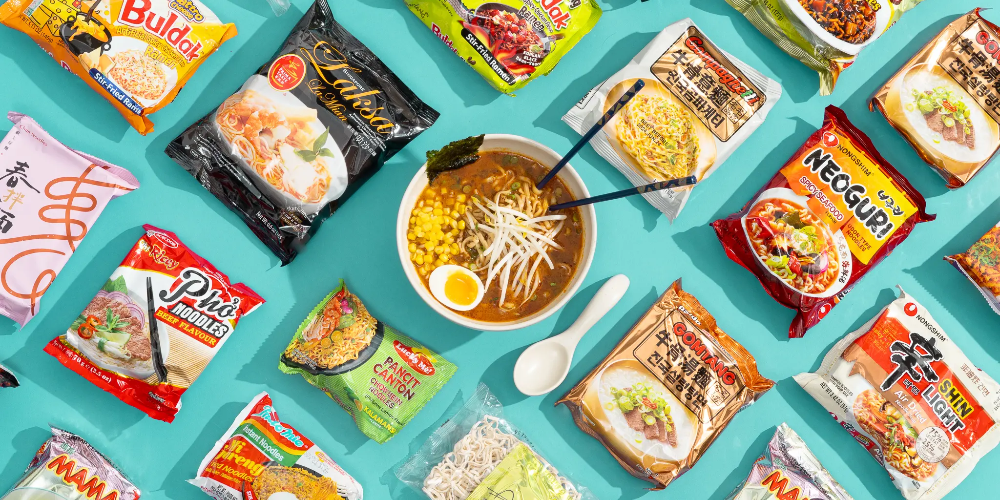
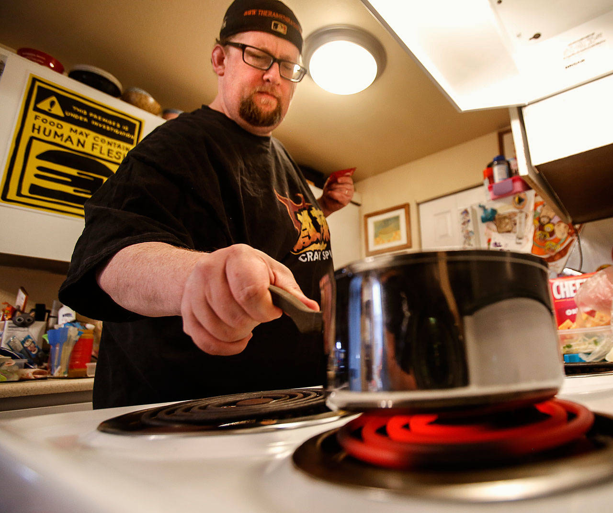
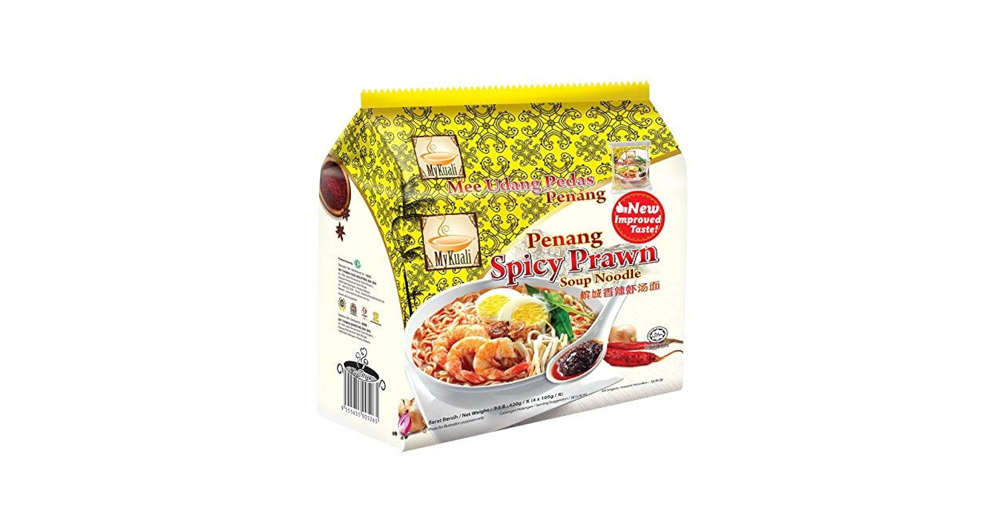

<style type="text/css">

body{ /* Normal  */
      font-size: 16px;
      text-align: justified;
}
.author {
  font-size: 14px;
  color: #8e8c84;
  text-align: center;
}
h1.title { /* Title*/
  font-size: 42px;
  color: Black;
  text-align: center;
}
h1 { /* Header 1 */
  font-size: 30px;
  color: Black;
  font-weight: bold;
}
p.caption{
  font: Lora;
  font-size: 14px;
}
</style>


```{r setup, include=FALSE}
# set up area for loading libraries/packages

library(tidyverse)
library(ggplot2)
library(knitr)
library(leaflet)
library(leaflet.extras)
library(hexbin)
library(broom)
library(scales)
library(kableExtra)
library(ggrepel)
library(maps)
library(dplyr)
library(cowplot)
library(magick)
library(showtext)

data_ramen <- read.csv("the-ramen-rater.csv")
data_ramen$stars <- as.numeric(data_ramen$stars)

#knitr::opts_chunk$set(echo = TRUE)
```


<center></center>

# The Ramen Rater
Instant ramen is more than survival food — it’s a global industry with hardcore enthusiasts. AKA *ramenphiles*. 


Since 2002, Hans Lienesch has been rating ramen on his blog **[The Ramen Rater](https://www.theramenrater.com/)**. For a decade he posted daily reviews, and in 2012 he was interviewed by a local newspaper when his blog gained a cult following surrounding **[The Big List](https://www.theramenrater.com/resources-2/the-list/)**.

<center>{width=125%}</center>


The Big List is just what it sounds like; a big list of all the ramen he has reviewed for 20+ years. 
**The Ramen Rater** has turned himself into a multifaceted brand with recipes, diet plans (yes, a ramen diet plan), merchandise, and international meet-ups with other *ramenphiles*.  

As of 2025, The Big List contains `r format(length(data_ramen$review), big.mark = ",")` ramen reviews from `r length(unique(data_ramen$country))` countries and `r length(unique(data_ramen$brand)) ` brands.

I'll be using The Big List to unleash my inner *ramenphile* and answer some burning questions. 


# Counting Stars

Let's get to know our reviewer first. Is he a harsh critic? 

The Ramen Rater rates on a 1-5 star scale. Let's look at his stats.
```{r Star Distribution, echo=FALSE, message=FALSE, warning=FALSE, fig.align='center'}
# make sure data doesn't include NAs
data_ramen <- 
  data_ramen %>%
    mutate(stars = as.numeric(stars)) %>% 
    filter(!is.na(stars))

# plot the data
font_add_google("Lora", "lora_font")  # so the graph font will match the rest of the blog
showtext_auto()  

ggplot(data_ramen, aes(x = stars)) +
  geom_histogram(binwidth = 0.5, fill = "#d95f02", color = "black" ) +       
  scale_x_continuous(breaks = seq(1, 5, 0.5), limits = c(1,5.5), expand = c(0,0)) + # adjusting axes for aesthetics
  scale_y_continuous(breaks = seq(0, 2000, 250), expand = c(0,0)) +
  labs(
    title = "Distribution of Ratings",
    x = "Star Rating",
    y = "Number of Reviews") +
  theme_minimal(base_size = 14) +
  theme(
    plot.title = element_text(hjust = 0.5, face = "bold", margin = margin(t = 20, b = 20), family = "lora_font", size = 24, color = "#666"), # margin: title placement
    axis.title.x = element_text(color = "#666", size = 20, family = "lora_font"),
    axis.title.y = element_text(color = "#666", size = 20,family = "lora_font"),
    axis.line = element_line(linewidth = 1),
    panel.grid.major.y = element_blank(),   # remove horizontal gridlines
    panel.grid.minor = element_blank()) +
  coord_flip()


ggsave("figures/fig_ramen-star-distribution.png")


```


We can see that The Ramen Rater has had some pretty low rated ramens. But on the other hand, he clearly isn't shy about giving out his 5-star ratings. Overall he shows a strong "middle of the road" rating average.


# The Ramen Rater Stats

We know that The Ramen Rater has been reviewing ramen for more than two decades. I wonder if he has gotten "nicer" or "harsher" over the years. We're going to run a linear model to see if we can show if The Ramen Rater has stayed consistent.

First let's visualize the ratings of all reviews over time.
```{r Ratings Over Time - plot, echo=TRUE, message=TRUE, warning=TRUE, fig.align='center'}
plot(stars~review, data_ramen)
```

This is a bit hard to interpret let's try and simplify the visual.

```{r ggplot for Model, echo=FALSE, message=FALSE, warning=FALSE, fig.align='center'}
# plot the data for visual
# put the reviews into bins of 100 for visual clarity
data_binned <- data_ramen %>%
  mutate(review.bin = (review %/% 100) * 100) %>%
  group_by(review.bin) %>%
  summarise(mean.stars = mean(stars), n = n())

# make the ggplot
ggplot(data_binned, aes(x = review.bin, y = mean.stars)) +
  geom_line(color = "#993404", linewidth = 1.2) +
  geom_point(color = "#d95f02", size = 2) +
  geom_smooth(method = "lm", se = FALSE, linetype = "dashed", color = "black") +
  labs(
    title = "Average Ramen Ratings Over Time",
    x = "Review Number (time)",
    y = "Average Star Rating" ) +
  theme_minimal(base_size = 14) +
  theme(
    plot.title= element_text(hjust = 0.5, face = "bold", margin = margin(t = 20, b = 20), size = 24, family = "lora_font", color = "#666"), # hjust & margin: title placement
  axis.title.x = element_text(color = "#666", size = 20, family = "lora_font"),                   # formatting to look cohesive
  axis.title.y = element_text(color = "#666", size = 20, family = "lora_font"),
  axis.line = element_line(linewidth = 1),
  panel.grid.major.x = element_blank())   

ggsave("figures/fig_ramen-ratings-time.png")
```

Now we can look at what the statistics say to get to the bottom of The Ramen Rater's consistency.

```{r Model and Summary Stats, echo=TRUE, message=FALSE, warning=FALSE, fig.align='center'}
model_ratings.time <- lm(stars~review, data = data_ramen)
anova(model_ratings.time)
summary(model_ratings.time)

```
Results show that The Ramen Rater's reviews have shifted slightly upward over time (F = 70.6, p < 0.001)

In the early days, ratings averaged about 3.5 stars. Every 1,000 reviews corresponds to an increase of about 0.09 stars, which means that by his most recent reviews his average rating has increased by roughly 0.4 stars. 

Statistically this is significant, but there may be other factors at play here. Maybe The Ramen Rater is just eating higher quality ramen now or maybe his love for ramen biases his reviews. Or (as one of my friends suggested) he's had such terrible ramen that his standards for decent ramen have shifted.

Whatever the case may be, I feel pretty content with The Ramen Rater as a reliable and consistent ramen reviewer.


# Cups, Bowls, Boxes, and Packs

Let's dive a little deeper into The Ramen Rater psyche, shall we? 

We can learn a bit about his preferences by looking at the different styles of ramen he's reviewed. 
There are 4 styles of ramen represented in the reviews: *cup, bowl, box and pack*. 

```{r Image Grid of Ramen Styles, message=FALSE, warning=FALSE, echo=FALSE, paged.print=FALSE, fig.align='center'}

plot_grid(
  ggdraw() + draw_image("images/cup-noodle.jpeg"),
  ggdraw() + draw_image("images/pack-noodle.jpeg"),
  ggdraw() + draw_image("images/box-noodle.jpeg"),
  ggdraw() + draw_image("images/bowl-noodle.jpg"),
  ncol = 2)

```

I want to see if The Ramen Rater rated a certain style higher than the others.

Just looking at this plot, we might think that The Ramen Rater has rated box-style ramen the highest the most frequently. 

Time to try that Lipton *Cup-a-Soup*! 

However, there is a little bit of sample size discrepancy going on here.

```{r Styles and Preference, echo=FALSE, message=FALSE, warning=FALSE, fig.align='center'}
#### rating by style ####

# get summmaries
sum_style <- 
  data_ramen %>%      
  group_by(style) %>%
  summarise(n = n(), 
            mean.stars = mean(stars),     
            sd.stars = sd(stars),                        # standard deviation and standard error for error bars
            se.stars = sd.stars/sqrt(n),
            ci.low = mean.stars - 1.96 * se.stars,       # 95% confidence intervals
            ci.high = mean.stars + 1.96 * se.stars)                            

# plot the data
ggplot(sum_style, aes(x = reorder(style, mean.stars), y = mean.stars)) +
  geom_errorbar(aes(ymin = ci.low, ymax = ci.high), width = 0.2, alpha = 1, color = "#d95f02" ) +
  geom_point( size = 5) +           
  scale_y_continuous(breaks = seq(3, 5, 0.25), limits = c(3,4.5), expand = c(0,0)) +
  labs(
      title = "Average Ramen Rating by Style", 
      x = "Style", 
      y = "Average Star Rating") +
  theme_minimal(base_size = 14) +
  theme(
    plot.title = element_text(hjust = 0.5, face = "bold", margin = margin(t = 20, b = 20), size = 24, family = "lora_font", color = "#666"),    # formatting for aesthetics
    axis.title.x = element_text(color = "#666", size = 20, family = "lora_font"),
    axis.title.y = element_text(color = "#666", size = 20, family = "lora_font"),
    axis.line = element_line(linewidth = 1),
    panel.grid.major.x = element_blank())   

ggsave("figures/fig_ramen-style-rating.png")

#### style work###
style_counts <- table(data_ramen$style)

cups <- style_counts["Cup"]
bowl <- style_counts["Bowl"]
pack <- style_counts ["Pack"]
box <- style_counts ["Box"]

```

The Ramen Rater reviewed `r scales::comma(cups)` cups, `r scales::comma(bowl)` bowls, `r scales::comma(pack)` packs, and only `r scales::comma(box)` boxes.

Let's plot the data again, this time excluding the boxes from our dataset.
```{r Styles and Preferece; NO BOX, echo=FALSE, message=FALSE, warning=FALSE, paged.print=FALSE, fig.align='center'}
#### plot without the box ####

# remove the boxes from the summary table
sum_style_no_box <- sum_style %>%
  filter(style != "Box")

# plot (copy code from above & use no_box data)
  # add label of avg. scores using annotate()
ggplot(sum_style_no_box, aes(x = reorder(style, mean.stars), y = mean.stars)) +
  geom_errorbar(aes(ymin = ci.low, ymax = ci.high), width = 0.2, alpha = 1, color = "#d95f02" ) +
  geom_point(size = 5) +           
  scale_y_continuous(breaks = seq(3.25, 4, 0.25), limits = c(3.25,4), expand = c(0,0)) +
  labs(
    title = "Average Ramen Rating by Style (no boxes)", 
    x = "Style", 
    y = "Average Star Rating") +
  annotate("text", x = c(1.15, 2.15, 3.15), y = c(3.486, 3.67, 3.85), label = c ("3.48", "3.67", "3.85"), color = "#666") +
  theme_minimal(base_size = 14) +
  theme(
    plot.title = element_text(hjust = 0.5, face = "bold", margin = margin(t = 20, b = 20), size = 24, family = "lora_font", color = "#666"),
    axis.title.x = element_text(color = "#666", size = 20),
    axis.title.y = element_text(color = "#666", size = 20),
    axis.line = element_line(linewidth = 1),
    panel.grid.major.x = element_blank())   

ggsave("figures/fig_ramen-style-rating-nobox.png")

```

From this figure, we can see that on average The Ramen Rater rated the pack-style ramen the highest. 

I personally agree with this, I was raised on *Chicken Flavor* Top Ramen and I still crave it every time I'm feeling a little under the weather. 


# Top Ten Lists

Okay, so we've learned that pack-style ramen is Queen of the Ramen Rater universe. 

But what about all the different brands The Ramen Rater has reviewed?  

Below is a table of the top 10 Ramen Rater pack-style ramen brands.


```{r Pack by Brands Table, echo=FALSE, message=FALSE, warning=FALSE, fig.align='center'}
# summarise the data
sum_brands_pack <-
  data_ramen %>%
  filter(style == "Pack") %>%
  group_by(brand) %>%
  summarise(n = n(),
            avg.stars = mean(stars)) %>%
  filter(n >= 15) %>%                                       # minimum 15 reviews
  arrange(desc(avg.stars), desc(n)) %>%                 
  slice_head(n = 10) %>%                                    # top 10
  transmute(Brand = brand,                                  # create a data frame using only Brand and Average Rating
            `Average Rating` = sprintf("%.2f", avg.stars))  # round to 2 decimals
# make the 
  kbl(sum_brands_pack,
  caption = "Table 1. Top 10 highest-rated brands of pack-style ramen with at least 15 reviews.",
  align = c("l","r")) %>%
  kable_classic() %>%
  column_spec(1, bold = TRUE) %>%
    kable_styling(html_font = "lora_font")

```

I'm a little disappointed to not see any of my favs on the list, but I will admit that my repertoire of ramen is not nearly as impressive as The Ramen Rater.

<center></center>

Looks like I'll be putting *MyKuali* on the grocery list! But can I? 

Where are theses brands manufactured? 

We know that The Ramen Rater does international reviews. I'm curious which country manufactures the highest rated ramens. 

Let's see:
```{r Top 10 Rated Countries, echo=FALSE, message=FALSE, warning=FALSE, fig.align='center'}
# summarise the data 
sum_top.countries <-
  data_ramen %>%
  group_by(country) %>%
  summarise(n = n(),
            avg.stars = mean(stars)) %>%
  filter(n >= 50) %>%                     # at least 50 reviews
  arrange(desc(avg.stars), desc(n)) %>%
  slice_head(n = 10) %>%                  # top 10
  transmute(Country = country,            # create a data frame using only Brand and Average Rating 
            `Average Rating` = sprintf("%.2f", avg.stars))  # round to 2 decimals 

kbl(sum_top.countries,
    caption = "Table 2. Top 10 countries with the highest rated ramen.",
    align = c("l","r")) %>%
  kable_classic() %>%
  column_spec(1, bold = TRUE)%>%
    kable_styling(html_font = "lora_font")
```

Malaysia is the country that manufactures the highest rated Ramen Rater ramens! 
And coincidentally that's exactly where I'll have to air-ship my *MyKuali* ramen order from.

# Hidden Gems

As a newly indoctrinated *ramenphile* I want to know where to find the less mainstream ramens are to really develop my palate.

I've created a map below that shows countries which have a high star rating average but also have less reviews overall to try and find those hidden gems which might get overshadowed in a large dataset.

Within each pin you'll find info about how many ramens The Ramen Rater has reviewed have been manufactured there, the overall star rating average, and the top rated ramen brand in that country to inspire your future shopping list. 

```{r Hidden Gems Map, echo=FALSE, message=FALSE, warning=FALSE, fig.align='center'}
# setting standards for map
min.country   <- 5      # at least this many reviews 
max.country   <- 100    # at most this many reviews
star.avg.country <- 3.6    # higher end average
min.brand.country <- 2      # at least 2 brands per country

# country summaries
country_stats <- 
  data_ramen %>%
  mutate(country = # fixing some names so they match world map
    dplyr::recode(country,"United States"= "USA","United Kingdom"= "UK","Sarawak"= "Malaysia","THailand" ="Thailand")) %>%
  group_by(country) %>%
  summarise(n = n(),
    avg.star = mean(stars, na.rm = TRUE))

# find "hidden gem" countries 
gems_country <- country_stats %>%
  filter(n >= min.country, n <= max.country, avg.star >= star.avg.country)

# filter out top rated brands/country 
brand_country <- data_ramen %>%
  semi_join(gems_country, by = "country") %>%                 # keep only hidden-gem countries
  group_by(country, brand) %>%
  summarise(n_brand = n(),                                    # summary table of brands and their average rating
    avg.brand.stars = mean(stars, na.rm = TRUE)) %>%
  filter(n_brand >= min.brand.country)                      # kick out countries reviewed that only had 1 brand

# find top brand per country
top_brand_country <- brand_country %>%
  arrange(country, desc(avg.brand.stars), desc(n_brand)) %>%
  group_by(country) %>%
  slice(1) %>%
  ungroup()

# load world map
world_map <- map_data("world")

# connect centroilds to map (copied code)
centroids <- world_map %>%
  group_by(region) %>%
  summarise(
    long = mean(range(long), na.rm = TRUE),
    lat  = mean(range(lat),  na.rm = TRUE))

# add coordinates for "hidden gems" (copied code)
gems_xy <- gems_country %>%
  left_join(top_brand_country, by = "country") %>%
  inner_join(centroids, by = c("country" = "region"))

# make the html labels
  # %s are placeholders for code to fill in
  # <b> is bold text
  # &nbsp;|&nbsp; "non-breaking spaces" around the | (for aesthetics)
  # <br/> line break
  # <i> italic text

lab <- sprintf( "<b>%s</b><br/>Avg: %s ★ &nbsp;|&nbsp; Reviews: %s<br/><i>Top brand:</i> %s (%s★)",
  gems_xy$country,                          # country
  sprintf('%.2f', gems_xy$avg.star),        # country avg
  scales::comma(gems_xy$n),                 # country review count
  gems_xy$brand,                            # top brand
  sprintf('%.2f', gems_xy$avg.brand.stars))       # top brand avg

# create the leaflet map
leaflet(gems_xy) %>%               
  addProviderTiles(providers$CartoDB.Positron) %>%          # basemap: https://leaflet-extras.github.io/leaflet-providers/preview/
  addCircleMarkers(lng = ~long, lat = ~lat,                   # adding circles at "gems"
    radius = 7,
    stroke = TRUE, weight = 1,
    fillColor = "Black",                                    # formatting aesthetics
    fillOpacity = 1.0,          
    label = lapply(lab, htmltools::HTML),                   # html code for label
    popup = lapply(lab, htmltools::HTML))                   # html code for hover feature 

```

# Take-Aways

From instant packs to international hidden gems The Ramen Rater has created a ramen empire that inspires thousands of people on the daily.
I know I'll be scouring the internet for ways to get my hands on his 5-star picks, and who knows maybe I'll even start my own blog. 

I found this dataset on [Kaggle.com](https://www.kaggle.com/datasets?fileType=csv)! It's free and I barely scratched the surface on potential datasets to practice with, go check it out :)
<center>{width=25%}</center>